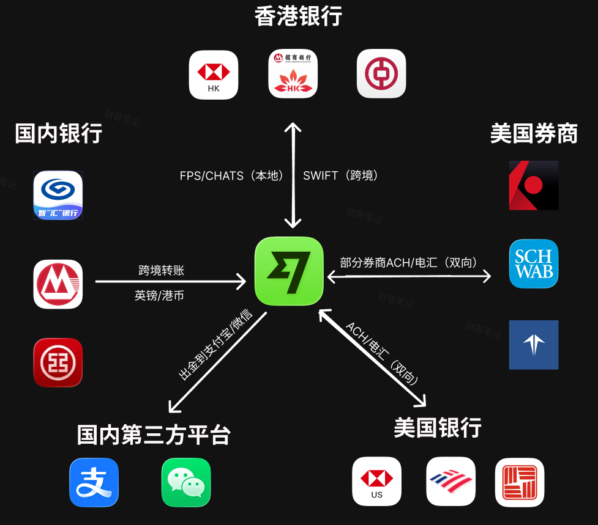
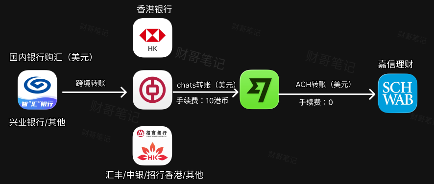
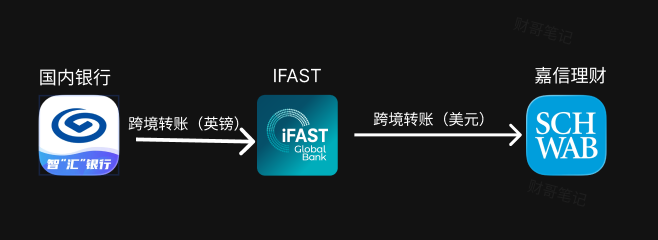
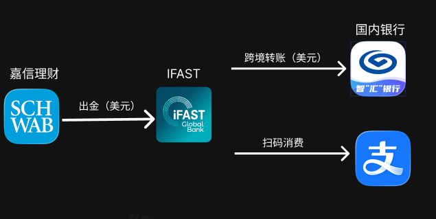

# wise
> 💡 **快速通道**：[查看美股教程主干道](../README.md)  
**简单一句话来说：** wise是一个多币种中转平台，可以和银行、券商、第三方平台直接进行交互。  

**银行：** wise可以和中国的银行、香港的银行、美国的银行进行跨境转账。

**券商：** 美国券商都支持跟wise进行交互，多数甚至支持ACH绑定，出入金非常方便。

**第三方：** wise可以和国内的第三方支付平台如支付宝微信直接进行资金交互。

以嘉信证券为例，通过wise进行入金是一个低成本的选择：

**划重点：wise注册时有两个注意事项：**  
开户要用**身份证**，不要用护照，否则港币账户开不了;    
开通后需要发邮件联系客服将中文名字改为英文名字（张三->ZHANG SAN）。  

# IFast
**简单一句话：** IFast是一家标准的英国银行，相比wise，国内的银行对它的风控会相对松。  

如果你没有港卡，可以通过ifast出入金，链路是这样

**入金**

**出金**

### 2026.07.15 ifast重大更新：开始支持扫码国内支付宝付款！    
这意味着如果美国券商的钱想回来，又多了一条渠道：即不用走传统链路，直接国内扫码消费掉。    
如果你需要注册ifast，欢迎通过<a href="https://www.ifastgb.com/en/tellafriend/yanzhongy2531" target="_blank">我的ifast邀请链接</a> 注册（或直接使用邀请码：`yanzhongy2531`），可以多拿5英镑奖励。
