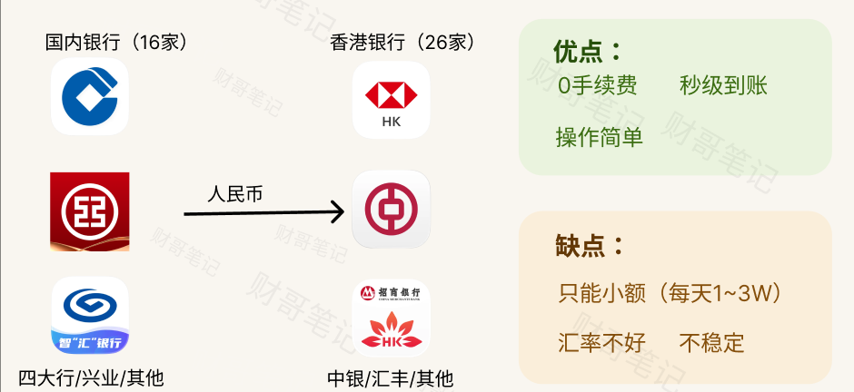
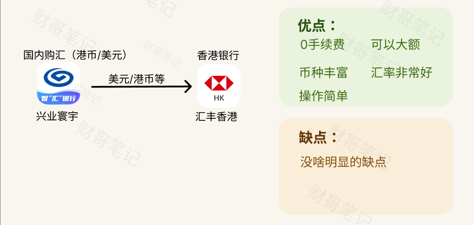
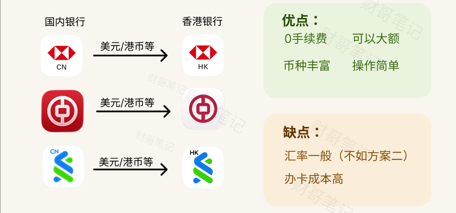
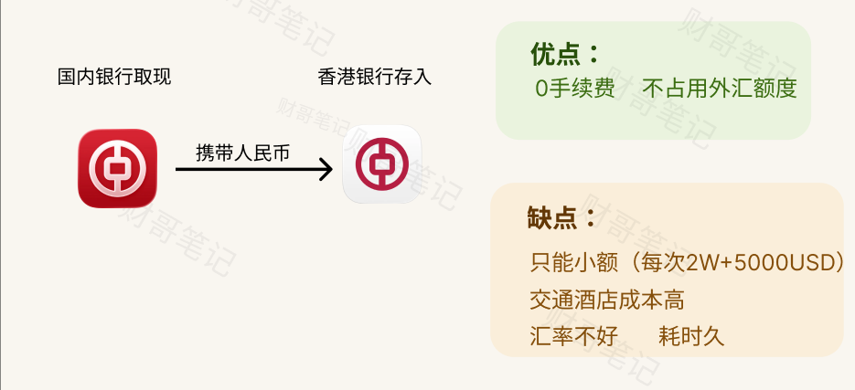

资金从内地到香港，4种低成本方案：

## 方案一：跨境支付通

跨境支付通是25年才搞的东西，将国内的清算系统跟香港的转数快（FPS）直接打通，没有中间方，不经Swift。核心优点就是**快，方便，没有手续费**。

但缺点也很明显：

- **只能小额。** 转账限制，每笔最多只能1W人民币。每天也有限制，最多的是工行，每天可以有3W人民币。这个留了一个口子，各银行是独立计额的。
- **汇率一般。** 到账港币时，汇率走的是代理行汇率而且本银行汇率，且汇率不如寰宇，不过金额不大可忽略。
- **不稳定。** 现在很多银行风控越来越严，频繁出去亦风控。明明政策的初衷是方便方便大家小资金到港，短短一年，风控越来越严。

## 方案二：兴业寰宇->汇丰香港

这条路径是一个非常经典的路径。在汇率、便利性、稳定性上都不错，可以作为一个长期方案选择。关键的是可以**大额**。

兴业这家银行思路很清晰，我其他卷不过你，我就主打跨境业务。

兴业银行总部并不在北上广深，在福建的福州。

不过26年之后兴业银行冲的人太多了，审核开始比之前要严格，如果触发风控了，要你去柜面办理，也不要慌，老老实实说明原因提供资料即可。

## 方案三：同行互转

同行互转很多银行是免费的，包括但不限于：

- 中国银行->中银香港
- 汇丰中国->汇丰香港
- 工商银行->工银亚洲
- 渣打中国->渣打香港

**注意：并非所有银行都免费，像招行这个坑爹的就不免费。**

这个方案，整体汇率不如方案二。办卡有门槛（国内汇丰难办，香港中银难办）。

## 方案四：携带现金在香港存入

这个方案最简单粗暴。

最大的优点我认为就是**不占用外汇额度**。

缺点有很多：

- 只能小额，单次只能携带人民币2W+5000USD。
- 汇率不好。内地的汇率整体看优于香港。
- 如果考虑交通住宿成本，还是有点高，适合旅游的时候顺便使用。