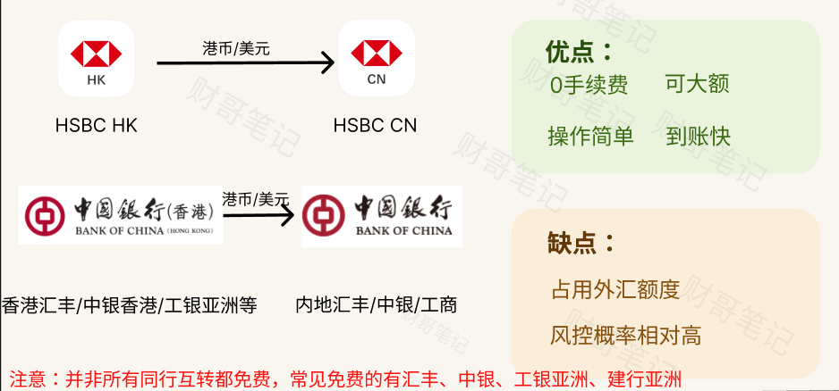
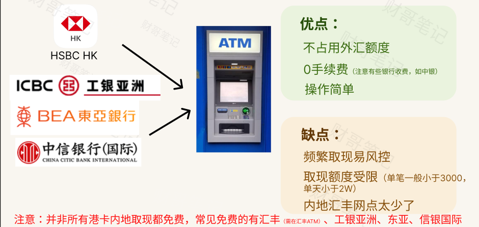
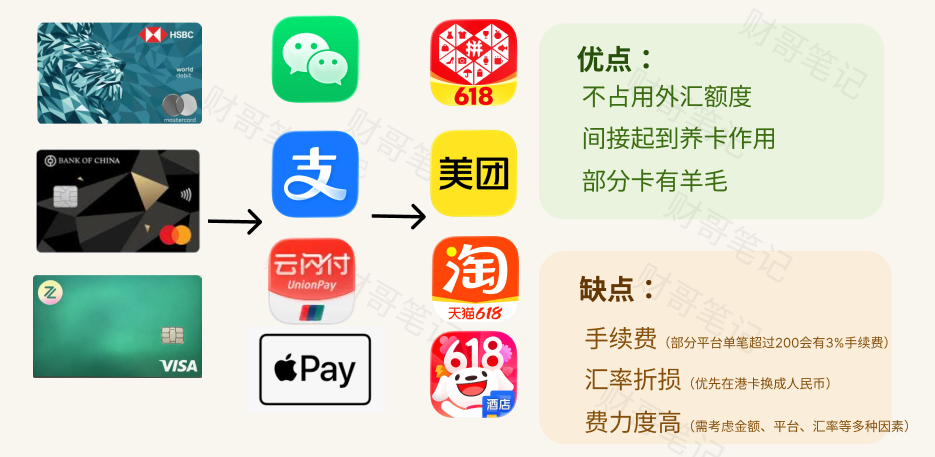
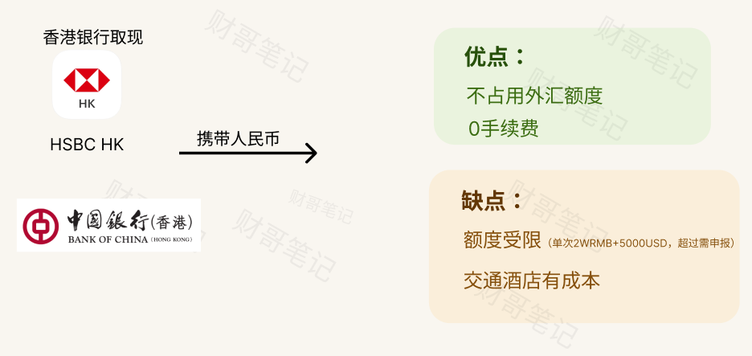

资金从香港到内地，4种低成本方案：

## 方案一：同行互转

香港银行直接转内地，在内地结汇，是资金回国的一个标准方案，**适合大额**。

而相同银行又有手续费的优势，推荐能同行则同行。

很多朋友国内没有汇丰，可以考虑在香港先把钱转到中银，再用中银通道回国。

## 方案二：港卡在国内ATM取现

适合临时取现国内周转，**小额应急**。

**注意：并非所有的银行取现都是免费，中银在内地取现会收50人民币手续费。**

而且最好在香港的时候就换成人民币，国内ATM直接按取港卡人民币余额。香港有些券商和一些数字银行汇率还可以。

## 方案三：港卡绑国内平台消费

适合**小额高频消费**，个人最喜欢的一种方案。

和方案二一样，优先在香港换成人民币，国内消费直接扣人民币。

日常刷的时候要注意超额手续费问题，**3%的手续费还是很贵的**。

而且这种方案还间接保持了港卡的活跃性，不至于因卡长期未使用被冻结，也算一举两得。很多朋友汇丰被冻卡，一个很重要的因素就是长期不活跃，突然之间有钱进来。

此外，有条件的还可以上车汇丰pulse，有**4.4%消费返现**，很不错一张卡。

## 方案四：香港取现后带回来

适合旅游去香港顺便操作，直接取人民币背回来，注意不要背太多。

