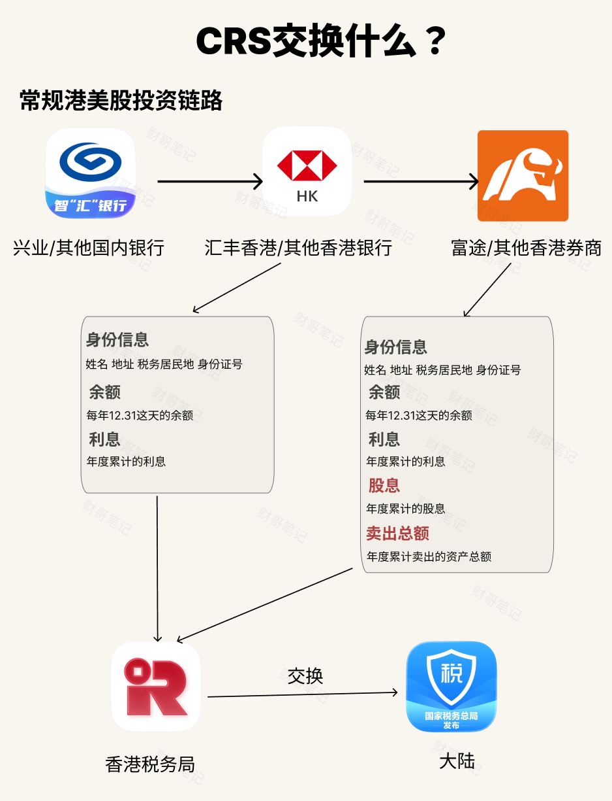
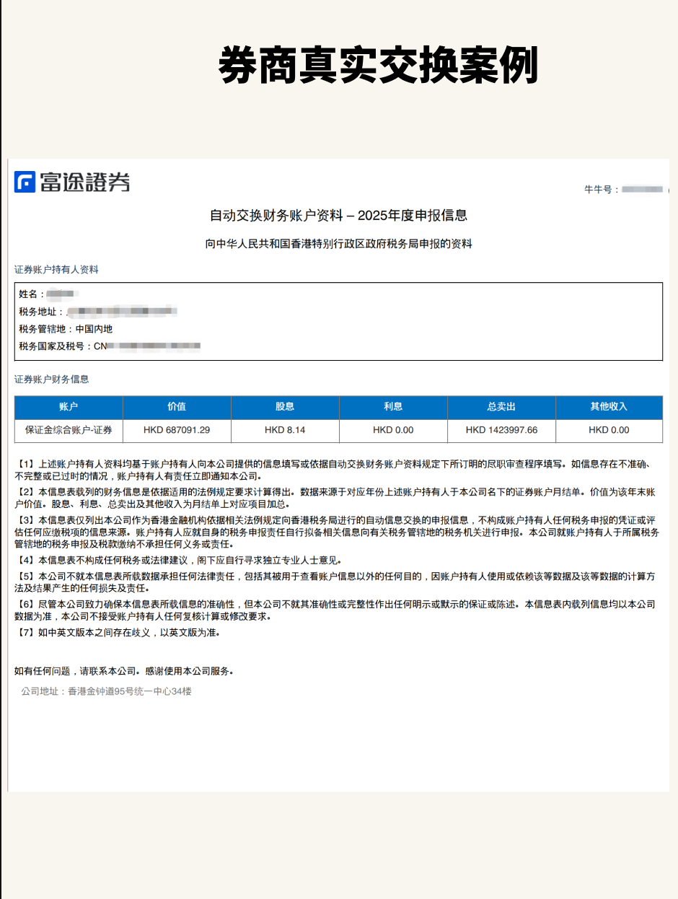

# 1.交换哪些信息？
> 💡 **快速通道**：[查看美股教程主干道](../README.md)  
>

## 香港本地银行：

**参与上报的信息：**

**身份信息**：包括姓名 地址 税务居民地 身份证号

**余额**：每年12.31这天的余额

**利息**：银行存款的利息

很多人以为上报但实际不上报的信息：转账明细，包括出入金券商明细。

## 香港券商：

**参与上报的信息：**

除跟银行一样上报身份信息、余额、利息这三个信息外，还有两项信息需要上报：

**股息**：年度累计的股息

**卖出总额**：年度累计卖出的资产总额

很多人以为上报但实际不上报的信息：交易明细，你买入卖出的明细是不上报的。

# 2.真实的富途信息交换案例

# 3.常见的几个问题

### Q1：哪些国家参与CRS？
A1:全球有120多个国家或地区都参与CRS，比如中国大陆，新加坡、中国香港、英国、日韩等。美国除外。

### Q2：使用香港的银行，哪些信息会参与CRS交换吗？

A2：**参与的**：身份信息、余额、利息  
**不参与的**：转账明细（注意：自动交换不含明细,但个案调查时可被单独调取，见 Q8）

### Q3：使用香港的券商，哪些信息会参与CRS交换吗？

A3：**参与的**：身份信息、余额、利息、股息、卖出的资产总额   
**不参与的**：买入卖出股票的明细

### Q4：上面Q3说的卖出总额是啥意思？
A4：举个例子：  
你的账户有10W美元，买入10万→ 卖出10万→ 买入10万→ 卖出10万，你一年的卖出总额就是20W美元，上报的总卖出也就是20W美元。  

换个极端点的例子：你账户只有1W美元，喜欢频繁操作，一年操作了100次，不考虑股价涨跌因素，你的总卖出就会有100W美元。

卖出总额衡量的是换手率,不是你的实际资产,也不是你赚那么多。

### Q5：是不是CRS上报了就要交税？
A5:上报≠交税。  
举个例子，财哥1W美元跑步入场，频繁交易，重仓猛干，一段操作猛如虎，年度卖出总额100W，年底账户只剩2000美元，亏了8000美元，这种部分就不会产生应纳税额。但是财哥买入的股票有股息，这部分依然是需要交税的。

### Q6:Wise参与CRS信息交换吗？

A6：参与，且wise中的美元账户也参与CRS信息交换。（也有情况例外:真实的美国税务居民、用真实美国身份注册的Wise US账户不走CRS的）

### Q7:美国的券商（如嘉信）、银行（如汇丰 US）参与CRS信息交换吗？

A7：都不参与。美国不加入 CRS。  
美国有自己的一套FATCA-这玩意要求别国把美国纳税人的相关信息报给他，它不交换给别国，完全是一个单向的机制。

### Q8:我使用港卡入金嘉信，会CRS吗？
A8:银行不会把转账明细上报，也就是出入金明细不会自动上报。

### Q9：说了那么多，什么时候会查明细？
A9:如果发现异常（比如你申报的境外资产远小于购汇累计额或交易流水特别大但无申报），中国税务机关是可以基于CRS收到的信息发起个案调查，向对方税务机关请求特定纳税人的更详细信息。**这时银行流水是能被调取的（划重点）**。

### Q10：哪些人群是重灾区？
A9:频繁交易导致年累计卖出额巨大（常见大于500W以上）；境外资金量大但境内无个税记录。

